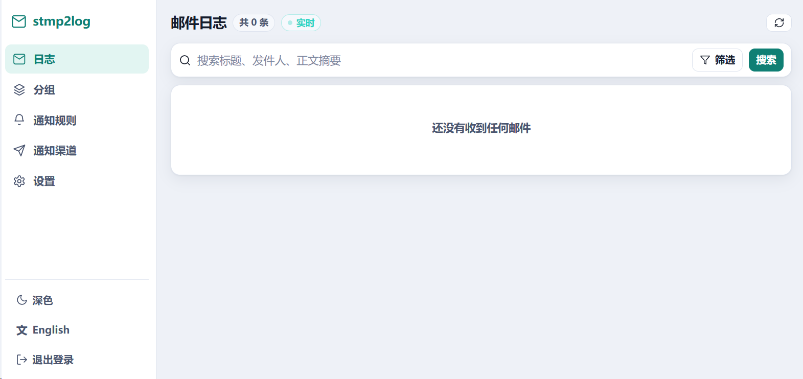

# stmp2log

一个简单的伪 SMTP 邮件接收器日志服务程序。

主要应用场景是：内网支持 SMTP 邮件告警的设备配置一个内网服务地址，统一收集日志并配置消息通知，解决邮箱配置麻烦、邮箱强制要求加密但设备不支持等问题，比如NAS、UPS等。

设备照常按"发邮件"的方式告警，**账号密码不用管**（默认什么都不校验，留空也行）；stmp2log 把信收下来、储存成可检索的日志，再按你配的规则推送到 ntfy / Bark / 钉钉 / 飞书等等。
它从不真的转发任何邮件。

---

## 快速开始

下载对应架构的二进制（见 [release 分支](../../tree/release)）：

写一个 `config.ini`：

```ini
stmp_listen=0.0.0.0:25 #stmp监听端口，为空的时候不启动stmp监听
data=./data #数据目录，为空默认值./data
# 服务端配置，端口为空的时候不开启web服务
web_listen=0.0.0.0:8025 #web服务端端口
web_pass=admin #web服务密码，为空的时候无密码登录
web_path=stmp2log # 后台url服务路径，为空默认为stmp2log
```

启动：

```sh
stmp2log -c config.ini
```

浏览器打开 `http://<本机地址>:8025/stmp2log/`，用 `web_pass` 登录。

### Docker部署
docker compose示例：
```yaml
services:
  stmp2log:
    pull_policy: always
    image: public.ecr.aws/sliamb/stmp2log:latest
    container_name: stmp2log
    restart: unless-stopped
    environment:
      - TZ=Asia/Shanghai
    volumes:
      # config.ini、日志分段文件、state.json、自签证书全在这一个目录下。
      - ./data:/data
    network_mode: "host"
```

**docker配置优先级**：第一次启动时按环境变量在 `/data/config.ini` 生成一份。
当配置文件存在的时候，忽略环境变量。

环境变量就是 ini 里的键名大写：
| 环境变量 | 默认 |
|---|---|
| `STMP_LISTEN` | `0.0.0.0:25` |
| `STMP_TLS_LISTEN` | 空（不开 465） |
| `STMP_HOSTNAME` | `stmp2log` |
| `STMP_USER` / `STMP_PASS` | 空（不校验） |
| `STMP_MAXSIZE` | `10M` |
| `WEB_LISTEN` | `0.0.0.0:8025` |
| `WEB_PASS` | 空，免登录|
| `WEB_PATH` | `stmp2log` |
| `PUSH_URL` | 空 |
| `MAX_ENTRIES` / `MAX_DAYS` | `5000` / `0` |
| `KEEP_RAW` / `KEEP_ATTACHMENTS` | `0` / `0` |


### 设备端怎么填

| 设备上的字段 | 填什么 |
|---|---|
| SMTP 服务器 | stmp2log 所在机器的 IP |
| 端口 | `stmp_listen` 里的端口；选 SSL 时填 `stmp_tls_listen` 的 |
| 加密方式 | 无 / STARTTLS / SSL 都行（SSL 需要配 `stmp_tls_listen`，STARTTLS 在明文端口上一直可用） |
| 账号 | **随便填，也可以留空**。默认不校验；填了会被记下来，可以在通知规则里按"SMTP 账号"过滤，所以建议填成能认出设备的名字 |
| 密码 | **随便填，也可以留空**。默认不校验；只有配了 `stmp_pass` 才有意义 |
| 发件人 / 收件人 | 随便填，建议发件人用能认出设备的地址，如 `ups-01@idc.local` |

### 可选配置

`config.ini` 里下面这些不写就用默认值：

| 键 | 默认 | 说明 |
|---|---|---|
| `stmp_tls_listen` | 关 | 隐式 TLS 的 SMTP 监听地址，设备选 "SSL" 时用，通常 `0.0.0.0:465` |
| `stmp_hostname` | 系统 hostname | SMTP 问候语里报的主机名，也是自签证书里的名字和转推来源名 |
| `stmp_user` / `stmp_pass` | 空 | **两项各自独立生效**：只配 `stmp_pass` 就只校验密码（账号随便报，用来区分设备），只配 `stmp_user` 就只校验账号，都不配则任意凭据放行、不做 AUTH 也照收。任意一项配了之后，不做 AUTH 的投递会被拒（`530`） |
| `stmp_maxsize` | `10M` | 单封邮件大小上限，支持 `512k` / `10M` 写法 |
| `max_entries` | `5000` | 最多保留条目 |
| `max_days` | `0` | 最多保留天数，0 表示不按时间删 |
| `keep_raw` | `0` | 保留原始邮件源码 |
| `keep_attachments` | `0` | 保存附件内容 |

最后四项在 Web 界面的"设置"里也能改，改完会**自动写回 `config.ini`**，注释和排版会原样保留。其余各项改完需要重启。

---

## 功能详解

**日志检索**。按时间范围、标题关键字、内容关键字、发件人地址、账号前缀（@ 前）、域名后缀（@ 后）、来源 IP、分组、是否带附件筛选。除"内容关键字"外全部在内存索引上完成，翻页是微秒级的；内容搜索才会顺序扫磁盘。新邮件通过实时推到列表页。

**保留策略**。最大保留条目、最大保留天数、是否保留原始邮件源码、是否保存附件，能在 `config.ini` 里配，也能在 Web 界面上改。默认保留 5000 条，可以控制磁盘占用。附件默认只记文件名、大小、类型，不存内容。打开"保存附件"之后可以在详情页直接下载（只对开启之后收到的邮件生效）。附件是日志里最占地方的东西，嵌入式设备上谨慎开启。

**归类分组**。按发件人后缀 / 账号前缀 / 关键字把告警自动分组，顺序即优先级，
第一个命中的分组生效 —— 分组列表可以拖动排序，也有上移 / 下移 / 置顶 / 置底按钮
（触屏上拖不动，所以按钮不是多余的）。改完规则可以对历史日志重新归类。

**黑白名单**。同一套条件语法，决定哪些邮件收下、哪些直接丢弃。被丢弃的邮件不入库、不触发通知，
但会在服务端日志里留一行——"设备明明发了但列表里没有"是最难查的故障。

**消息通知**。没有条件的规则就是全局通知；带条件的就是条件通知。条件语法和归类分组完全一样，
在分组页学会的写法到通知页原样适用，而且多两个字段：**所属分组**（下拉选，不用把分组的条件
再抄一遍）和 **SMTP 账号**（设备 AUTH 时报的账号，天然能区分来源）。标题和正文支持模板变量
（`{{subject}}` `{{from}}` `{{body}}` `{{time}}` `{{group}}` `{{peer}}` 等）。
每条规则可设冷却时间——设备故障时一分钟能发几十封，没有冷却手机会被推送淹没。

支持的渠道：ntfy、Bark、钉钉、飞书等等。

**多节点汇总**。配一行 `push_url` 就能把本机收到的每条日志转推到另一台 stmp2log：

```ini
push_url=http://stmp.example.com:8025/stmp2log
```

不同区域各跑一台就近收信，再统一汇到一台机器上看。推送同步使用 `web_pass` 加密和鉴权，每条推送带上发送方的 `stmp_hostname`，汇总端按它区分来源。转推来的日志不会再次转发。汇总端可以只开 Web 不收信（`stmp_listen` 留空）。
